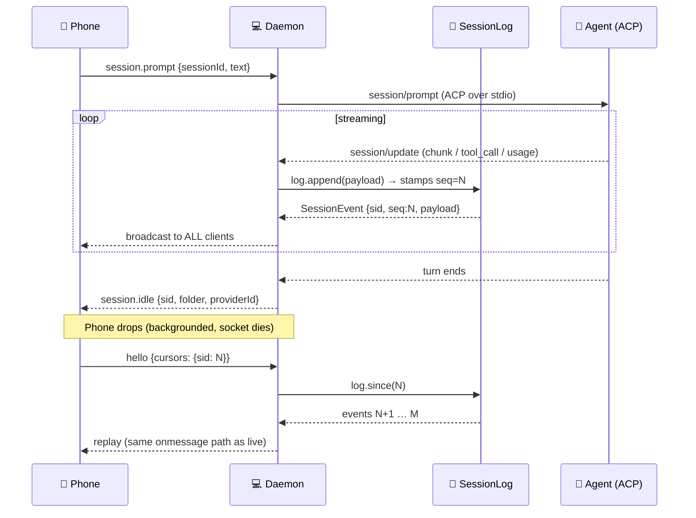
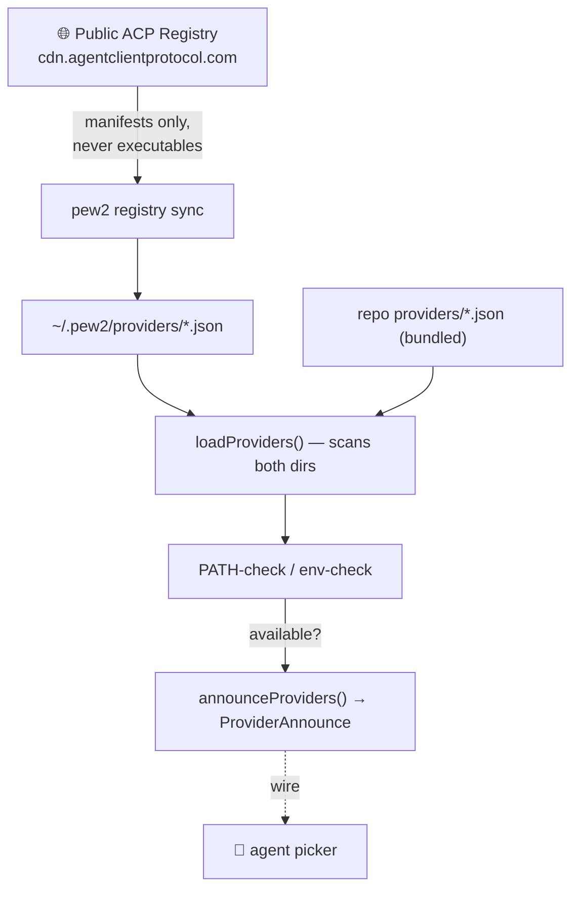
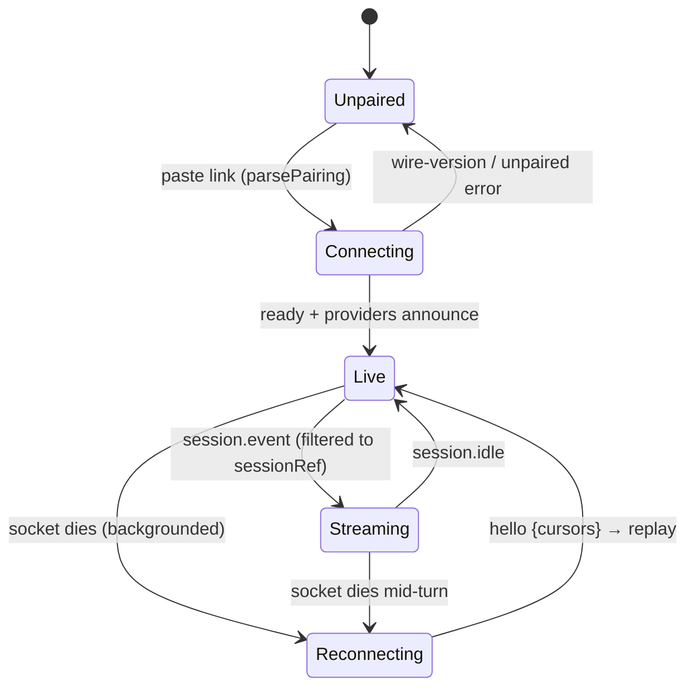

# pew2 — Architecture Deep Dive

> Mobile remote control for **desktop coding agents**. The agent runs on your
> machine; the phone is a thin client that watches, prompts, and answers
> permission requests. **pew2 is transport + UI, not an agent.**

---

## 1. The core idea in one sentence

The [Agent Client Protocol](https://agentclientprotocol.com) (ACP) is
**one-client-to-one-agent**. pew2 inserts a **daemon that owns the session log**
so that *many* clients (a phone, a desktop) can watch and drive *one* agent —
and so a client that drops off can replay everything it missed, because **ACP
itself never re-sends**.

Everything else in the codebase falls out of that one decision.

---

## 2. The four packages

```mermaid
graph TB
    subgraph phone["📱 packages/app — Expo / React Native"]
        UI["UI (ChatThread, Composer, Sidebar)"]
        UD["useDaemon.ts — the client state machine"]
        PURE["pure logic (chunks, cursors, replayFold,\nactivity, notificationPolicy…)"]
    end

    subgraph proto["📦 packages/protocol — the shared contract"]
        WIRE["wire.ts — Zod envelope + WIRE_VERSION"]
        CHAN["channel.ts / crypto.ts — E2EE (XChaCha20)"]
        MAN["manifest.ts — provider schema"]
    end

    subgraph relay["☁️ packages/relay — Cloudflare Worker + DO"]
        ADM["admission.ts — token/room gate"]
        DO["Durable Object — routes frames,\npersists seq'd events in SQLite"]
    end

    subgraph daemon["💻 packages/daemon — your machine"]
        SRV["server.ts (LAN) / relay-client.ts (remote)"]
        HND["handler.ts — every message case"]
        LOG["SessionLog — append-only, seq'd"]
        ACP["acp/connect.ts — spawns + speaks ACP"]
    end

    AGENT["🤖 Claude Code / Codex / Gemini / …\n(child process, ACP over stdio)"]

    UI --> UD --> CHAN
    CHAN -.wss.-> relay
    relay -.wss.-> daemon
    SRV --> HND --> LOG
    HND --> ACP -->|stdio| AGENT
    proto -. imported by both .-> phone
    proto -. imported by both .-> daemon

    style proto fill:#1a2b3a,stroke:#4a9
    style daemon fill:#2a1a3a,stroke:#a49
    style relay fill:#3a2a1a,stroke:#a94
    style phone fill:#1a3a2a,stroke:#4a9
```

| Package | Lines-of-responsibility | Why it exists |
| --- | --- | --- |
| **protocol** (5 files) | Zod schemas for the wire envelope + provider manifest, and the E2EE channel. Imported by **both** daemon and app so a message type can't work on one side and not the other. | Single source of truth. `WIRE_VERSION` lives here. |
| **daemon** (41 files) | Spawns agents, speaks ACP over stdio, owns the seq'd log, warm spares, probe cache, config prefs, the `pew2` CLI. | The fan-out point. The only place that touches the local machine. |
| **relay** (2 files) | One Durable Object per pairing; routes opaque frames between `daemon`/`app` roles, persists events in DO SQLite for replay. | Lets phone and daemon reach each other with **neither** holding a public address. |
| **app** (85 files) | Expo client. ~32 **pure** logic modules + UI. Adding an agent is dropping a `providers/*.json`. | The thin client. Deliberately Expo-free in its logic half so `bun test` can load it. |

---

## 3. The stack

| Layer | Choice | Notable |
| --- | --- | --- |
| Runtime | **Bun** ≥1.2 | daemon, CLI, tests all run on Bun |
| Language | **TypeScript**, strict | `tsc --strict` in 3 passes (root / relay / app) |
| Validation | **Zod** | every wire message + manifest validated at the boundary |
| Crypto | **@noble/ciphers** | XChaCha20-Poly1305, E2EE phone↔daemon |
| Transport | **WebSocket** | LAN direct, or `wss://` via relay |
| Agent protocol | **ACP** over stdio | `@agentclientprotocol/sdk` |
| Edge | **Cloudflare Worker + Durable Object** | Hibernation = free idle sockets; DO SQLite = the event store |
| Client | **Expo / React Native** (SDK 54) | FlashList v2, Reanimated, keyboard-controller, glass effects |

---

## 4. The load-bearing pattern: the seq'd session log

This is the heart. ACP hands the daemon a stream of `session/update`
notifications. The daemon does **not** forward them live-only — it **appends
each to an append-only log that stamps a gapless `seq`**, then broadcasts.

**Why gapless seq matters:**
- **Two clients, one agent.** Phone and desktop see identical streams because
  both read the same log, not the agent directly.
- **Reconnect replay.** A client sends its `cursors` in `hello`; the daemon
  replays `log.since(cursor)`. ACP would never re-send, so without the log a
  reconnecting phone would see a frozen, half-finished conversation.
- **One rendering path.** Replayed events take the *same* `onmessage` path as
  live ones (`cursors.ts` drops anything ≤ the cursor), so there is exactly one
  code path to get right.

**The subtle rule:** a **replay batch must not set `busy` or raise a permission
sheet** (`replayFold.ts`) — those describe a turn happening *now*. A replayed
last chunk is not work-in-progress (perpetual spinner) and its permission was
answered long ago (phantom approve sheet).

---

## 5. The security model: E2EE with a routing/reading split

The relay **routes** but **cannot read**. This is the whole reason it's safe to
run traffic through someone else's edge.

```mermaid
graph LR
    subgraph link["Pairing link"]
        T["?pairing=TOKEN\n(routes to a room)"]
        K["#k=KEY\n(fragment — never sent to a server)"]
    end

    T -->|"names the room"| R["☁️ Relay DO<br/>sees only ciphertext"]
    K -->|"decrypts frames"| CH["🔐 SecureChannel<br/>XChaCha20-Poly1305"]

    D["💻 Daemon"] -- "seal(daemon→app key)" --> R
    R -- "opaque frame" --> P["📱 App"]
    P -- "open(daemon→app key)" --> CH

    style R fill:#3a2a1a,stroke:#a94
    style CH fill:#1a2b3a,stroke:#4a9
```

- **Token** = a bearer secret (32-char floor). It only *names a room*. The relay
  rejects an unpaired socket at the HTTP upgrade — a bad token never connects.
- **Key** rides in the URL **fragment** (`#k=`). A fragment is **never
  transmitted to a server**, so the relay routes a connection it can never
  decrypt. `parsePairing` refuses a link missing `#k=` *before* opening a socket
  — a keyless link could only decrypt nothing later and fail opaquely.
- **Direction by role.** `SecureChannel` seals with the daemon→app key and opens
  with app→daemon (or the reverse). A replayed/misdirected frame can't be opened
  with the wrong key.
- **Counter + replay window** (`ctr`) on every envelope stops frame replay.

**Known gaps (honest):** no forward secrecy, no per-device revocation. One key
lasts the life of a pairing; a leaked key decrypts past traffic and removing a
device means re-pairing all of them. This is *why* the project says "run it for
yourself."

---

## 6. Provider system: adding an agent is one JSON file

A manifest is **id + name + how to launch it** (`npx pkg` or a `command`) plus
pew2 metadata (transport, color, env). No code, no rebuild. `registry sync`
pulls ~40 agents' manifests but **never downloads executables** — a binary-only
agent lights up once you install it its own way. The daemon PATH-checks each at
load, so a missing binary reads as *unavailable* rather than crashing a spawn.

---

## 7. Two transports, one handler

The single most important structural rule for correctness:

```mermaid
graph TB
    LAN["server.ts<br/>(LAN WebSocket, :8787)"]
    REMOTE["relay-client.ts<br/>(wss to the DO)"]
    H["handler.ts<br/>owns EVERY message case"]

    LAN -->|"supplies reply/broadcast"| H
    REMOTE -->|"supplies reply/broadcast"| H
    H --> LOG["SessionLog"]
    H --> ACP["acp/connect.ts"]

    style H fill:#2a1a3a,stroke:#a49
```

`handler.ts` owns every case; `server.ts` (local) and `relay-client.ts` (remote)
only supply `reply`/`broadcast`. **A case added to one path would make local and
remote silently drift** — so there is exactly one handler.

---

## 8. The daemon's harder-won subsystems

These are the modules that exist because a naive version had a specific bug:

| Module | Problem it solves |
| --- | --- |
| `workspace.ts` | Under launchd `cwd` is `/`; agents treat cwd as project root. `resolveWorkspace()` is the single default (explicit → env → cwd → home) used by session start *and* the capability probe. |
| warm spares (`index.ts`) | Boot an agent ahead of the tap so opening a session is instant. Gated on `spareReady`, not `warming`, or a disk-cached probe spawns a duplicate. |
| `session-prefs.ts` | A model is **per conversation**. `config-prefs.json` seeds the *next new* session; `session-prefs.json` (keyed by provider+agent-session-id) is replayed on `session/load`, because ACP resumes a transcript but hands back the agent's *default* selectors. |
| `projects.ts` | Projects are folded from the **uncapped** session list, before the recent-work cap — so grouping doesn't hide every repo not touched this week. |
| `agentHistory.ts` | `needsResume()` — the one rule for whether to reopen a conversation (the agent's own copy, or one the daemon no longer holds) vs. render from memory. |
| `images.ts` / `attachments.ts` | Images flow daemon→app on demand (`image.fetch`, never in the log — would re-download on every replay); attachments flow app→daemon into tempdir (never cwd, which `git add .` would commit). |
| `errors.ts` | `humanError()` normalises every agent failure at the one point all transports share — the real reason hides in JSON-RPC `data.details`, sometimes double-encoded. |

---

## 9. The app's client state machine

`useDaemon.ts` is the phone's brain. Everything hard about it is about **not
trusting the socket** (it dies on every backgrounding) and **filtering the
broadcast** (the daemon sends every session to every client).

Load-bearing details:
- **Filter events against `sessionRef.current`** — the daemon broadcasts *every*
  session; an abandoned one still streaming would otherwise render into the open
  chat.
- **`session.idle` is the one broadcast NOT filtered** — it's the only signal a
  background conversation finished, which is exactly the one nobody's watching.
- **Turn ids are `${sessionId}:${seq}`** — `seq` restarts per session, so seq
  alone collides and React merges unrelated turns.
- **Pure/Expo split** — logic modules (`chunks`, `cursors`, `replayFold`,
  `transcription`, `pairingLink`…) import no Expo, so `bun test` can load them;
  the native bindings live in thin `ui/*` wrappers.

---

## 10. Why the boundaries are where they are

The whole design is one trade repeated at every layer:

> **Put the irreplaceable knowledge on the side that has it, and make everything
> else a thin, testable, replaceable shell.**

- Only the **daemon** can read a file the agent named → `image.fetch` lives
  there, not in the phone.
- Only the **phone** knows what's rendered → error-promotion (`errorDedup`) and
  the render cursor live there, not in the daemon.
- Only the **protocol** package is the truth about the wire → both sides import
  it; neither restates it (except the app's attachment limits, which Metro can't
  import, and a test guards against drift).
- The **relay** knows *routing* but not *content* → it can be someone else's
  infrastructure without being trusted.

That single principle is what lets "adding an agent" be one JSON file, and
"reconnecting a phone" be a cursor replay through code that never knew the
socket dropped.

---

## 11. Patterns worth reusing elsewhere

Several of pew2's building blocks solve problems that are not specific to coding
agents at all. They are worth lifting into other systems.

```mermaid
graph TB
    subgraph reuse["Reusable cores"]
        LOG["① Seq'd log + cursor replay"]
        RELAY["② Route-but-can't-read relay"]
        MAN["③ Manifest-driven plugins"]
        SPLIT["④ Pure-core / thin-native split"]
    end
    LOG --> U1["collab editors, live dashboards,\nchat, CI log streaming, multiplayer state"]
    RELAY --> U2["remote access, IoT control,\nP2P without port-forwarding"]
    MAN --> U3["CI runners, deploy targets,\nLLM providers, data connectors"]
    SPLIT --> U4["any React Native / Electron /\ncross-platform app"]
    style LOG fill:#1a3a2a,stroke:#4a9
    style RELAY fill:#3a2a1a,stroke:#a94
    style MAN fill:#2a1a3a,stroke:#a49
    style SPLIT fill:#1a2b3a,stroke:#4a9
```

### ① The seq'd log as a fan-out point *(the strongest to reuse)*

One owner writes an **append-only, numbered log**; many readers replay from a
**cursor**. This is the answer to any "many watchers, one source, must survive
disconnects" problem — collaborative editors, live dashboards, multiplayer game
state, chat, CI log streaming, market feeds. It is essentially **event sourcing
plus cursors**, and pew2's version (`SessionLog.append` / `.since`) is small and
self-contained enough to extract as a standalone module. The load-bearing rules
travel with it: gapless sequence numbers, replay through the *same* path as the
live stream, and "current state" signals (like `busy`) kept *out* of the log
because they describe now, not history.

### ② The route-but-can't-read relay

A middleman that connects two parties who both dial **out** (so neither needs a
public address), passing **sealed envelopes it cannot open**. This fits
self-hosted remote access, IoT device control, and any "reach my home machine
from my phone" tool. The Cloudflare Durable Object + Hibernation detail is what
makes it cheap: idle connections cost nothing, and the DO's SQLite doubles as
the event store, so there is no separate database. The relay is ~2 files — the
easiest core here to lift.

### ③ Manifest-driven plugins (data, not code)

Adding an integration is dropping **one JSON file**; a public registry syncs new
ones with no release; nothing executable is ever downloaded. This turns "we
support N things" into "we support the ecosystem," and applies to any tool with a
growing integration surface — CI runners, deploy targets, LLM providers, data
connectors. It is a schema plus a loader, so it is cheap to adopt.

### ④ Pure-core / thin-native split

Business logic imports **zero** platform SDKs, so it is unit-testable off-device;
native bindings live in thin wrappers. This applies to every React Native,
Electron, or cross-platform app, and is what lets pew2 test its hardest logic
(`chunks`, `cursors`, `replayFold`, `transcription`) with `bun test` and no
simulator.

### How reusable each is

| Pattern | Reusability | Effort to extract |
| --- | --- | --- |
| Seq'd log + cursor replay | Very high | Medium — a small, clean core |
| Route-can't-read relay | High | Low — the DO is ~2 files |
| Manifest plugins | High | Low — a schema + loader |
| Pure-core / thin-native split | High (as discipline) | Free — it is a convention |

**If you extract one thing, extract the seq'd log with cursor replay.** It solves
a problem — live + reconnect + multi-viewer — that recurs almost everywhere, and
pew2's implementation is compact and already battle-tested against real
reconnects.
